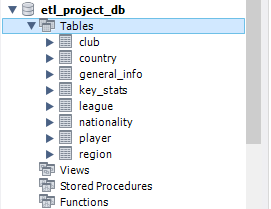
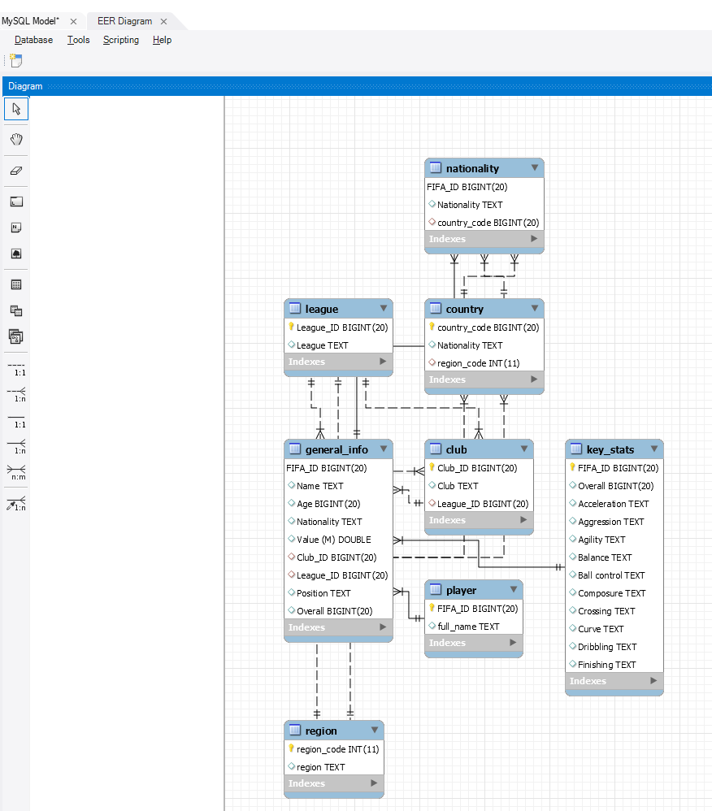

# ETL PROJECT

Columns being grabbed:

ID, Name, Value(M), Position, Overall, full_name, club, age, height, weight, nationality,Acceleration,Aggression,Agility,Balance,Ball control,Composure,Crossing,Curve,Dribbling,Finishing

Tables: MERGE ON ID
(1)
ID, Name, Value(M), Position, Overall, full_name, club, age, height, weight, nationality
(2)
ID, Acceleration,Aggression,Agility,Balance,Ball control,Composure,Crossing,Curve,Dribbling,Finishing

#IMPORTANT: REPLACE USERNAME AND PASSWORD in ```config.py```

#Execute Project_ETL file in Jupyter Notebook


Report: FIFA database 

With the plethora of sources to extract player stats from online, as well the shear number of leagues and levels of professional play, it was overwhelming to find the details needed to answer questions on the fly. Who is the most valuable player? How do real-world season stats correlate to in-game stats? There are countless questions that may come to mind. So, with this, we set out to create a database that had 2 requirements: (1) The database will be separated into easily searchable tables, and (2) Include as many players as possible across all professional leagues and teams.

Finding statistics on professional soccer players is not difficult. There are so many websites and data collection boiling plates that given time, one can find statistics that get so specific, it’s surprising to even find a table with such numbers recorded. Goals by which leg was used, when during a match a player is most likely to score, etc. Further, these stats can be filtered by league and club, giving comprehensive stats for teams.
Our 2 major data sources were found on Kaggle, providing most of our data. The tables were already contained in easy to access CSV files that we simply loaded into a Jupyter Notebook. Using Pandas, we were able to merge the 2 massive tables into a complete dataset, resulting in a total of 17738 players with 187 measured stats each. Obviously, the next step would be to tame this beast and get some clean, useful data.

We decided to stick with the 10 standard measurement stats that FIFA uses to determine the skill level of players in the game, including an Overall stat that averages them. To correspond with this, we held on to real life statistics such as age, height/weight, nationality, as well as club/league, player trade value (standardized to euros), and position.

Further, we filtered down to the top-rated players, only keeping players with at least a 75-overall rating. The result was a clean database with the top 1499 players complete with all the statistics we found relevant to this project. 
Now that we had this complete data frame, we wanted to import into a database for ease of access and searchability. We chose MySQL because of how well it handles relational databases, which we used extensively to create a network of tables to contain relevant data points.

From a technical perspective, this proved to be the most challenging and time-consuming section of the process. The data was split into tables that were categorized relatively to what we found to be relational data points, one for example separating FIFA stats so the database could be used simply for real world player biopics.


The result: We were able to create a relational database in MySQL that is easily searchable and accessible. The ease of access of Pandas made this a quick and manageable project that is ready to be submitted to a website or comprehensive report. 




	
Another great thing we were able to do is pull up stats from the 2018 FIFA World Cup. With this data, we attempted to draw comparisons from performance in the World Cup with general Season stats, like player value. This shows that having a comprehensive dataset that includes most professional players can be paired with other tables to draw interesting conclusions.

In the future, it would be beneficial to dig deeper into more online data sources, to extract data points over multiple years or seasons. With this, we can see the changes in specific players stats as well as see how leagues and teams are affected by players being traded around. Further, we can take this to the next level and import the data into an online accessible website with HTML/CSS to join the ranks of data sources that we felt were too messy or unclear to be affective on this scale.


